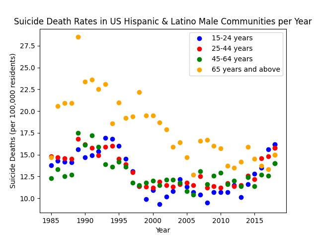
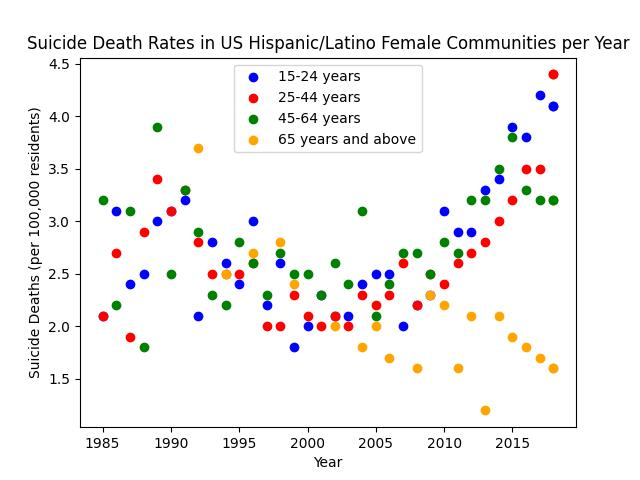
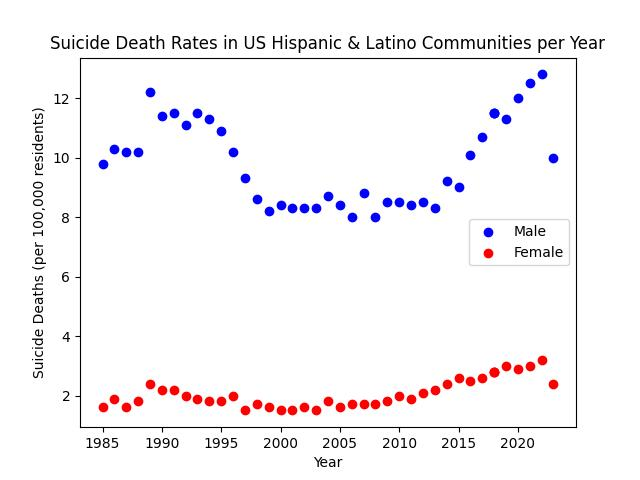
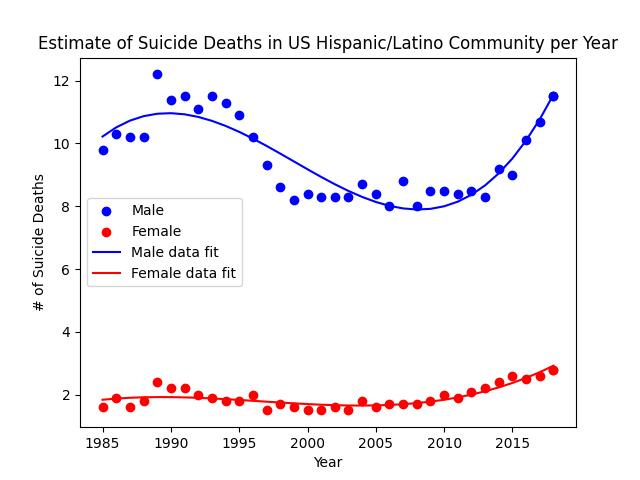
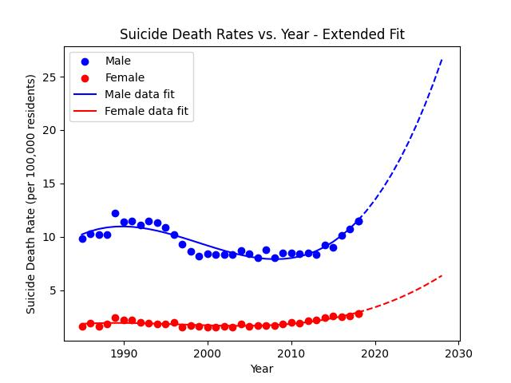

# Suicide Death Rates within the US Hispanic & Latino Communities.
Analysis of the suicide death rates of the Hispanic &amp; Latino population within the United States. Data collected from the Centers for Disease Control and Prevention (CDC) and the Office of Minority Health (OMH).  

## Datasets 
[Death rates for suicide, by sex, race, Hispanic origin, and age: United States (CDC)](https://data.cdc.gov/NCHS/Death-rates-for-suicide-by-sex-race-Hispanic-origi/9j2v-jamp/about_data)  
[Mental & Behavioral Statistics via OMH (Office of Minority Health)](https://minorityhealth.hhs.gov/mental-and-behavioral-health-hispanics)  
[Underlying Cause of Death, 2018-2021, Single Race (CDC Wonder)](https://wonder.cdc.gov/controller/datarequest/D158;jsessionid=8656C16750ED571516010C46F032)  
[Provisional Mortality Statistics, 2018 through Last Week (CDC Wonder)](https://wonder.cdc.gov/mcd-icd10-provisional.html)  

##  Terminology to Know 
[Age-Adjusted vs. Crude Data](https://www.nlm.nih.gov/oet/ed/stats/02-600.html#:~:text=It%20is%20important%20to%20remember,for%20comparisons%20to%20other%20populations.)  

## Articles & Papers
[Rising Latino suicide rates worry community leaders](https://www.nbcnews.com/news/latino/rising-latino-suicide-rates-worry-community-leaders-rcna134363)  
[Hispanic Child Suicides in the United States, 2010-2019](https://pubmed.ncbi.nlm.nih.gov/34997530/)  
[A Look at the Latest Suicide Data and Change Over the Last Decade](https://www.kff.org/mental-health/issue-brief/a-look-at-the-latest-suicide-data-and-change-over-the-last-decade/)  
[Life Expectancy Increases, However Suicides Up in 2022](https://www.cdc.gov/nchs/pressroom/nchs_press_releases/2023/20231129.htm)  
[Understanding Death Data (CDC)](https://www.cdc.gov/surveillance/blogs-stories/understanding-death-data.html) 
[Behavioral Health Concerns about Hispanic and Latino Americans](https://www.samhsa.gov/behavioral-health-equity/hispanic-latino)  

##  Visualizations 

 
##  Conclusions 
Observed a higher rate of suicide deaths in the male Hispanic & Latino community when compared to the female population. A higher rate of suicide deaths is present in people younger than 65 within the female population as of 2018, while men see an increasing rate of comparable magnitude across all age brackets except at 65 years or above at which the rate has plateaued. Rates of suicide deaths seeminly experienced a slump from approximately 2000 to 2010, before seeing an increase.  

Data for 2022 and 2023 is provisional and extracted from CDC Wonder. 

Will visualize and compare these trends to comparable ones for different races (White, Black or African American, Asian or Pacific Islanders, American Indian or Alaskan Native). These different race groupings defined by the CDC.  

<!---  ---!>
<!---  ---!>
