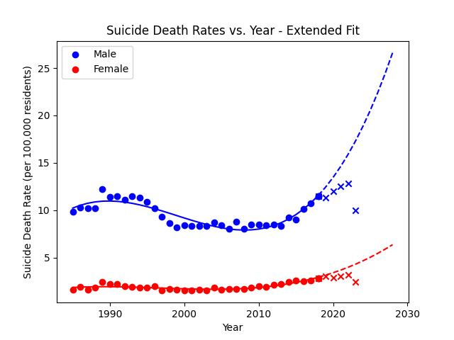

# Suicide Death Rates within the US Hispanic & Latino Communities.
Analysis of the suicide death rates of the Hispanic &amp; Latino population within the United States. Data collected from the Centers for Disease Control and Prevention (CDC) and the Office of Minority Health (OMH).  

## Datasets 
[Death rates for suicide, by sex, race, Hispanic origin, and age: United States (CDC)](https://data.cdc.gov/NCHS/Death-rates-for-suicide-by-sex-race-Hispanic-origi/9j2v-jamp/about_data)  
[Mental & Behavioral Statistics via OMH (Office of Minority Health)](https://minorityhealth.hhs.gov/mental-and-behavioral-health-hispanics)  
[Underlying Cause of Death, 2018-2021, Single Race (CDC)](https://wonder.cdc.gov/controller/datarequest/D158;jsessionid=8656C16750ED571516010C46F032)  

##  Terminology & Statistics to Know 
[Age-Adjusted vs. Crude Data](https://www.nlm.nih.gov/oet/ed/stats/02-600.html#:~:text=It%20is%20important%20to%20remember,for%20comparisons%20to%20other%20populations.)  
[Behavioral Health Concerns about Hispanic and Latino Americans](https://www.samhsa.gov/behavioral-health-equity/hispanic-latino)  

##  Results 

## Conclusions 
Observed a higher rate of suicide deaths in the male Hispanic & Latino community when compared to the female population. A higher rate of suicide deaths is present in people younger than 65 within the female population as of 2018, while men see an increasing rate of comparable magnitude across all age brackers. Rates of suicide deaths seeminly experienced a slump from approximately 2000 to 2010, before seeing an increase.  

Will visualize and compare these trends to comparable ones for different races (White, Black or African American, Asian or Pacific Islanders, American Indian or Alaskan Native). These different race groupings defined by the CDC. 
