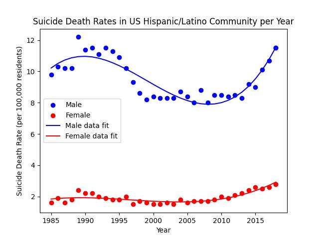

# Suicide Death Rates within the US Hispanic & Latino Communities.
Analysis of the suicide death rates of the Hispanic &amp; Latino population within the United States. Data collected from the Centers for Disease Control and Prevention. 

## Datasets 
[CDC Data](https://data.cdc.gov/NCHS/Death-rates-for-suicide-by-sex-race-Hispanic-origi/9j2v-jamp/about_data)  
[Mental & Behavioral Statistics via OMH (Office of Minority Health)](https://minorityhealth.hhs.gov/mental-and-behavioral-health-hispanics)  

### Useful sites to explain some terminology 
[Age-Adjusted vs. Crude Data](https://www.nlm.nih.gov/oet/ed/stats/02-600.html#:~:text=It%20is%20important%20to%20remember,for%20comparisons%20to%20other%20populations.)  

## Results 

## Conclusion 
WIP
