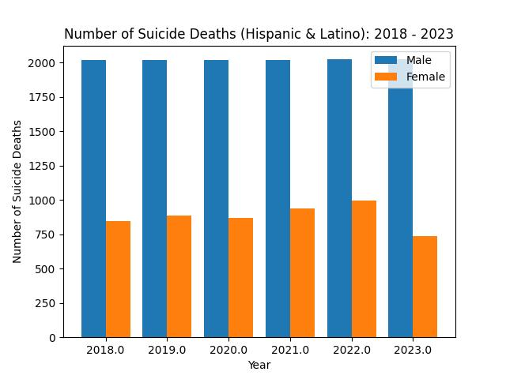

# Suicide Death Rates within the US Hispanic & Latino Communities, 1985 - 2023

## Motivation & Goals
The New York Times has published numerous articles on the rise of mental health symptoms being observed in the younger generations in the United States [1][2][7], as well as higher suicide death rates reported[3][4]. Coming from a Hispanic background, I wish to observe how mental health distress may be affecting the Hispanic & Latino groups within the U.S. by analyzing data on the suicide death rate in these communities. Factors such as poverty, language barriers, and lack of bilingual mental health resources have been cited as a rise in Latino suicide deaths over the years, as well as heightened worry about behavioral healths concerns in the demographic [5][6]. Data is collected from the Centers for Disease Control and Prevention (CDC) and the Office of Minority Health (OMH). Visualizations of suicide trends within the different demographics, genders, and age brackets are constructed. 

## Datasets 
[Death rates for suicide, by sex, race, Hispanic origin, and age: United States (CDC)](https://data.cdc.gov/NCHS/Death-rates-for-suicide-by-sex-race-Hispanic-origi/9j2v-jamp/about_data)  
[Mental & Behavioral Statistics via OMH (Office of Minority Health)](https://minorityhealth.hhs.gov/mental-and-behavioral-health-hispanics)  
[Underlying Cause of Death, 2018-2021, Single Race (CDC Wonder)](https://wonder.cdc.gov/controller/datarequest/D158;jsessionid=8656C16750ED571516010C46F032)  
[Provisional Mortality Statistics, 2018 through Last Week (CDC Wonder)](https://wonder.cdc.gov/mcd-icd10-provisional.html)  

##  Terminology to Know 
[Age-Adjusted vs. Crude Data](https://www.nlm.nih.gov/oet/ed/stats/02-600.html#:~:text=It%20is%20important%20to%20remember,for%20comparisons%20to%20other%20populations.)  
[Understanding Death Data (CDC)](https://www.cdc.gov/surveillance/blogs-stories/understanding-death-data.html) 

## Articles & Papers
[A Look at the Latest Suicide Data and Change Over the Last Decade](https://www.kff.org/mental-health/issue-brief/a-look-at-the-latest-suicide-data-and-change-over-the-last-decade/)  
[Life Expectancy Increases, However Suicides Up in 2022](https://www.cdc.gov/nchs/pressroom/nchs_press_releases/2023/20231129.htm)  

##  Visualizations 

 
##  Conclusions 
Observed a higher rate of suicide deaths in the male Hispanic & Latino community when compared to the female population. A higher rate of suicide deaths is present in people younger than 65 within the female population as of 2018, while men see an increasing rate of comparable magnitude across all age brackets except at 65 years or above at which the rate has plateaued. Rates of suicide deaths seeminly experienced a slump from approximately 2000 to 2010, before seeing an increase.  

Data for 2022 and 2023 is provisional and extracted from CDC Wonder. Provisional data is subject to change until the data are reconciled and verified with the state and territorial data providers. 

Will visualize and compare these trends to comparable ones for different races (White, Black or African American, Asian or Pacific Islanders, American Indian or Alaskan Native). These different race groupings defined by the CDC.  

## References 

1. Richtel, M. (2024, January 29). Teen drug and alcohol use linked to mental health distress. _The New York Times_.
2. Richtel, M. (2022, April 23).'It's Life or Death': The Mental Health Crisis Among U.S Teens. _The New York Times_.
3. Caron, C. (2023, August 11). U.S. Suicide Deaths Rose in 2022, C.D.C. Estimates Say. _The New York Times_.
4. Barry, E. (2023, July 11). Following a Two-Year Decline, Suicide Rates Rose Again in 2021. _The New York Times_.
5. _Rising Latino suicide rates worry community leaders_. (2024, January 17). NBC News. https://www.nbcnews.com/news/latino/rising-latino-suicide-rates-worry-community-leaders-rcna134363
6. https://www.samhsa.gov/behavioral-health-equity/hispanic-latino
7. Price, J. H., & Khubchandani, J. (2022). Hispanic Child Suicides in the United States, 2010-2019. _Journal of community health_, _47_(2), 311–315. https://doi.org/10.1007/s10900-021-01054-4

<!---  ---!>
<!---  ---!>
